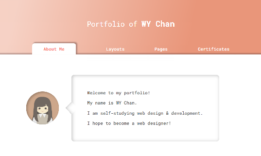

👋 Hi, I’m @wy-chan

## My Portfolio 

| <h3><a href="https://wy-chan.github.io/Portfolio/">Web Development Portfolio:</a></h3><kbd></kbd> |
| ------ |

---

|||
|-----------------------------------------------------------------------------------------------------------------------------------------------------------|-------------------------------------------------------------------------------------------------------------------------------------------------------------------------------|
   
---
## My Credly Badges
→ [see all badges](https://www.credly.com/users/wy-chan/badges)

<!--START_SECTION:badges-->

[![[CLE-10-01] CLE – C Certified Entry-Level Programmer](https://images.credly.com/size/110x110/images/101483f0-ed9b-46c8-b018-f5290e60a6a1/cle.png)](http://www.credly.com/badges/d173d27b-73f8-44eb-a390-f15e27fc510b "[CLE-10-01] CLE – C Certified Entry-Level Programmer")
[![[PCEP-30-01] PCEP – Certified Entry-Level Python Programmer](https://images.credly.com/size/110x110/images/d8017c77-3cc0-4fdf-8e17-62e50632812e/bronze_1_small.png)](http://www.credly.com/badges/36f83975-ef56-4003-b9e3-b73fce521372 "[PCEP-30-01] PCEP – Certified Entry-Level Python Programmer")
<!--END_SECTION:badges-->

---

- <a href="#top">Back to Top</a> -

<!---
wy-chan/wy-chan is a ✨ special ✨ repository because its `README.md` (this file) appears on your GitHub profile.
You can click the Preview link to take a look at your changes.
--->

